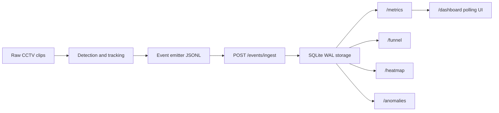

# Design

## Architecture Overview

The system is split into two independently runnable layers. The CV pipeline turns anonymized CCTV clips into structured behavioral events. The FastAPI application ingests those events, stores them idempotently, and computes metrics, funnel, heatmap, anomalies, health, store discovery, and a live dashboard from the event stream.

This separation is deliberate. Scoring tests can post held-out events directly to the API without requiring a GPU. The pipeline can be improved or replaced without changing the business logic contract, as long as it emits the documented event schema.

## Data Flow

Video processing discovers clips recursively under `datasets/cctv_footage/`. The updated footage is store-scoped: `Store 1` maps to `STORE_BLR_002`/`ST1008`, and `Store 2` maps to `STORE_MUM_1076`/`ST1076`. Camera identity is inferred from explicit source hints first, then filename keywords such as `entry`, `zone`, and `billing`, then numeric fallbacks. Layout discovery checks for JSON first, then Excel. The supplied workbook and layout screenshots are visual assets rather than machine-readable polygons, so the pipeline keeps normalized default zones in `configs/store_layout.generated.json` and `configs/cameras.example.yaml`.

## Event and Session Model

Every event has a UUID event id, store id, camera id, visitor id, event type, UTC timestamp, optional zone, dwell duration, staff flag, confidence, and metadata. The visitor id is the session key for metrics. Reentry is represented by reusing the same visitor id and emitting a `REENTRY` event rather than a second unique session.

The API accepts the canonical schema and the newly supplied sample-event format. `app/event_normalizer.py` maps lower-case sample event types such as `entry`, `zone_entered`, `queue_completed`, and `queue_abandoned` into canonical event types, converts `store_1076`/`ST1076` into `STORE_MUM_1076`, links sample zone/queue `track_id` rows back to entry `id_token` values using demographics when available, and creates deterministic UUID-v4 ids for idempotency.

The API excludes `is_staff=true` events from business metrics. It keeps low-confidence events rather than silently dropping them; confidence contributes to the `data_confidence` response field.

POS transactions have no customer id, so conversion is a time-window correlation: a non-staff visitor with a billing touch in the five minutes before a transaction can be counted as converted. To avoid inflating conversion, each POS transaction is matched to the nearest not-yet-converted billing visitor.

## Storage Model

SQLite in WAL mode is the default because it keeps `docker compose up` simple and is enough for the challenge evaluator. Tables:

- `events`: one row per ingested event, unique by `event_id`.
- `pos_transactions`: aggregated POS transaction rows, unique by store and transaction id.
- `ingestion_audit`: accepted, duplicate, and rejected counts per ingest request.

The SQLAlchemy boundary is intentionally thin. A Postgres migration would mostly change `STORE_DB_URL`, add Alembic migrations, and tune indexes/partitioning.

## Failure Handling

Ingest validates each event independently. Good events are accepted even when other rows in the same batch are malformed. Duplicate event ids are counted as duplicates and do not fail the request. Batches above 500 events are rejected to protect memory and latency.

Database failures are translated into HTTP 503 JSON responses. Unhandled exceptions return a generic structured error, never a raw stack trace. Request middleware adds a trace id and JSON logs with endpoint, method, store id, latency, event count, and status code.

The detector tries Ultralytics first. If dependencies or weights are unavailable, it emits fallback events with `metadata.fallback_reason` and lower confidence. This keeps the repo runnable while making the uncertainty visible.

## Scaling Notes for 40 Stores

For 40 stores, the first bottleneck is not FastAPI but metric recomputation over an unbounded event table. The immediate scaling path is:

- Keep events append-only and partition by store/date in Postgres.
- Maintain incremental rollups for active queue depth, dwell totals, and funnel sessions.
- Move detection workers outside the API container and push batches through a queue.
- Keep API nodes stateless behind a load balancer.
- Store camera configs per store in a managed table rather than JSON files.

SQLite is intentionally an acceptance-friendly default, not the final fleet storage plan.

## Observability and Logging

Each request log is JSON and includes `trace_id`, `endpoint`, `method`, `store_id`, `latency_ms`, `event_count`, and `status_code`. `/health` reports DB status, configured-store last event timestamps, stale feed warnings when lag exceeds 10 minutes, version/build fields, and uptime. `/stores` lets the dashboard populate a store menu from configured stores plus observed events/POS data. The dashboard polls live endpoints rather than reading files, so replaying JSONL visibly exercises the same API path as production ingestion. The live detection page also has a store-scoped clip menu and optional mask/SAM refinement toggle that is off by default for speed.

## AI-Assisted Decisions

1. Model selection: AI suggested comparing YOLO11, YOLOv8, RT-DETR, and tracking options. I accepted the comparison structure but changed the final default to RT-DETR-X after checking official AP numbers. YOLO remains supported as a fallback when built-in tracking IDs or lower memory are more important than the small AP advantage.

2. Event schema: AI suggested preserving confidence and staff flags on every event rather than only on tracks. I accepted that because the API can explain low confidence and exclude staff without needing CV internals.

3. Sample-resource compatibility and storage: AI suggested loosening the event schema and using Postgres immediately. I overrode both for challenge reliability: the schema stays strict with a pre-validation normalizer for the new sample JSONL, and SQLite WAL remains the default because reviewers need `docker compose up` with no manual setup.
